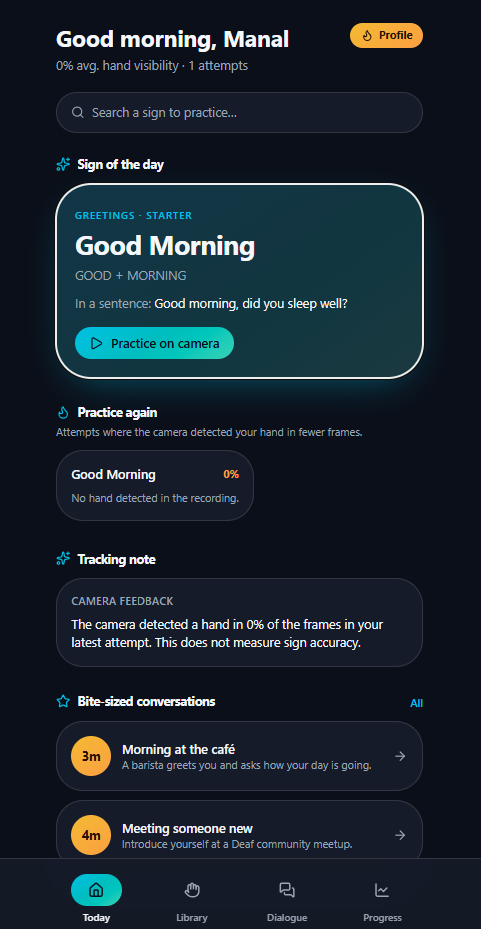
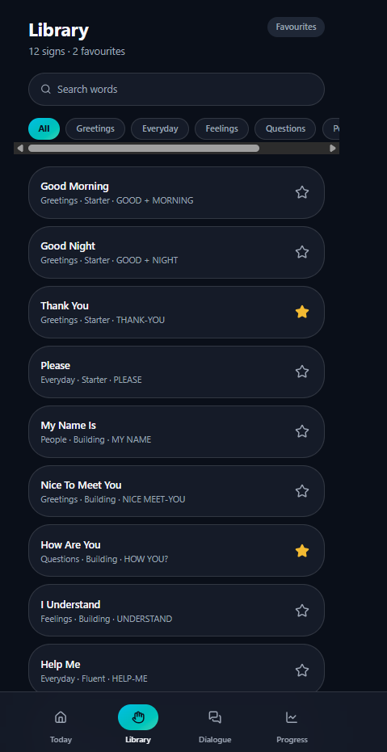
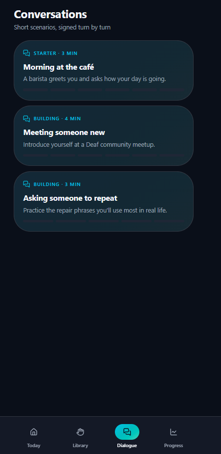

# SignSense Pro

A browser-based ASL practice app that helps beginners learn signs through guided repetition, webcam feedback, and contextual vocabulary review.

## Product goal

The app currently combines:
- searchable sign vocabulary
- category-based review
- favourite word tracking
- webcam-enabled practice flow
- MediaPipe-based hand landmark detection
- sign reference guidance with contextual sentences

---

## Why Sign Sensei?

Learning sign language is difficult because meanings are often carried by:
- facial expression
- handshape
- movement
- spatial position
- body posture
- direction

Most beginner resources are either too overwhelming or too passive. Learners need short, targeted lessons and immediate feedback on what they are doing wrong.

This app addresses that by making practice feel structured and approachable.

---

## Screenshots

| Today | Library | Dialogue |
|---|---|---|
|  |  |  |

- **Today** — the daily landing view is a "sign of the day" card with a sentence example and a "Practice on camera" action.
- **Library** — the full vocabulary list (12 signs and counting), filterable by category (Greetings, Everyday, Feelings, Questions, People…).
- **Dialogue** — short, context-based scenarios that give the vocabulary from the Library context in realistic mini-conversations.

---

## Architecture

```
┌─────────────────────────────────────────────────────────┐
│                        Browser                           │
│                                                           │
│   TanStack Router                                        │
│   ┌───────────┬───────────┬────────────┬─────────────┐  │
│   │  Today    │  Library  │  Dialogue  │  Progress    │  │
│   │  (Home)   │ (routes)  │  (routes)  │  (routes)    │  │
│   └───────────┴───────────┴────────────┴─────────────┘  │
│         │              │                                 │
│         ▼              ▼                                 │
│   AppShell (layout, bottom nav)                          │
│         │                                                 │
│         ▼                                                 │
│   practice.$slug.tsx  ──▶  HandTracker.tsx                │
│                              │                             │
│                              ▼                             │
│                       MediaPipe Tasks Vision                │
│                       (hand landmark detection,             │
│                        runs on-device via WebGL/WASM)       │
│                                                           │
│   lib/signs.ts — vocabulary + sign metadata (source of   │
│   truth for Library, Dialogue, and Today's "sign of the  │
│   day")                                                   │
└─────────────────────────────────────────────────────────┘
```

**Flow of a practice attempt:**
1. User picks a sign (from Today, Library, or a Dialogue step) and lands on `practice.$slug.tsx`.
2. `HandTracker.tsx` requests camera access and streams frames into MediaPipe Tasks Vision.
3. MediaPipe returns hand landmarks per frame; the component currently tracks **hand visibility** (what fraction of frames had a detected hand) as an initial feedback signal, shown back to the user as a "tracking note" — it does not yet score sign *accuracy*.
4. Results are surfaced on the Today screen as "Practice again" prompts for low-visibility attempts.

**Current project structure**
```
src/routes/library.tsx        # sign library and favourites flow
src/routes/practice.$slug.tsx # main practice experience
src/components/HandTracker.tsx# camera + MediaPipe tracking
src/lib/signs.ts              # vocabulary and sign metadata
src/components/AppShell.tsx   # layout shell and navigation
```

**Technical stack**
- React + TypeScript
- Vite
- TanStack Router
- Tailwind UI patterns
- MediaPipe Tasks Vision for hand landmark detection
- Local browser-first architecture (no server, no persisted accounts yet)

This stack is appropriate for a polished frontend prototype and keeps the app fast and portable.

---

## Development commands

```bash
npm install
npm run dev
```

To build production output:

```bash
npm run build
```

---

## Development

Prefer working locally? You need Node.js and npm — [install with nvm](https://github.com/nvm-sh/nvm#installing-and-updating).

```sh
git clone <this-repository-url>
cd <repository-name>
npm i
npm run dev
```

---

## Future

- Move beyond hand-*visibility* tracking toward actual sign scoring — comparing landmark sequences against a reference gesture (handshape, movement, and position) rather than just "was a hand seen."
- Bring facial expression and non-manual markers (eyebrow raise, mouth shape, head tilt) into feedback, since ASL grammar often lives there, not just in the hands.
- Slow-motion / frame-by-frame playback of an attempt next to a reference clip.
- Expand the Library well past the initial 12 signs, with difficulty tiers (Starter → Building → Fluent, already hinted at in the Dialogue cards).
- Build out the Progress tab: streaks, accuracy trends over time, mastery-by-category, and spaced-repetition-style resurfacing of signs the learner struggles with.
